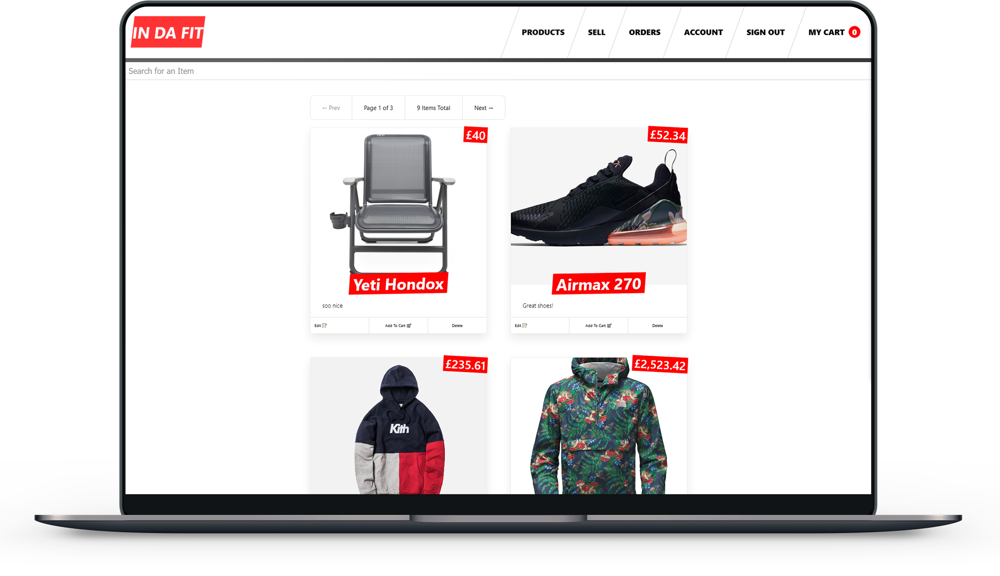

# In Da Fit - React JS | Next.js | Node.js | TypeScript



> This project was created following Wes Bos' Fullstack Advanced React & GraphQL course.

<br><br>
## 💻 Technologies:

* React JS `<Next.js | Styled Components | React-Apollo | Custom Hooks>`
* Apollo Client / Server `<GraphQL Queries | Mutations | Caching | Errors>`
* Keystone JS `<Node.js | CRUD API | MongoDB | Schemas | Relationships | Emails | Checkout | Authentication | Roles | Permissions>`.
* Stripe `<Cards Payment and Validation>`

<br><br>
## 🚀 Installing

In order to install you need to enter on both folders separetly (frontend/backend) and run:

Npm
```
npm run install
```
<br><br>
## ☕ Running
In order to fully run the project locally you need to register upon some of the services used and fill up the details onto the .env files.

Services Used:

* <a href="https://stripe.com/gb">Stripe</a> (Payments)
* <a href="https://cloudinary.com/">Cloudinary</a> (Image Hosting)
* <a href="https://ethereal.email/">Ethereal</a> (Fake SMTP Service)
* <a href="https://www.mongodb.com/cloud/atlas">MongoDB</a> (DataBase)

After getting the services keys you need to spin up both services (frontend/backend) by running the following command on each folder:
<br><br>
```
npm run dev
```
<br><br>
When both projects are up you can see them running on their respectives URL's:
<br><br>
Front End:
```
http://localhost:7777
```
<br>

Backend:
```
http://localhost:3000
```

<br><br>
[⬆ Back to top](#in-da-fit---react-js--nextjs--nodejs--typescript)<br>